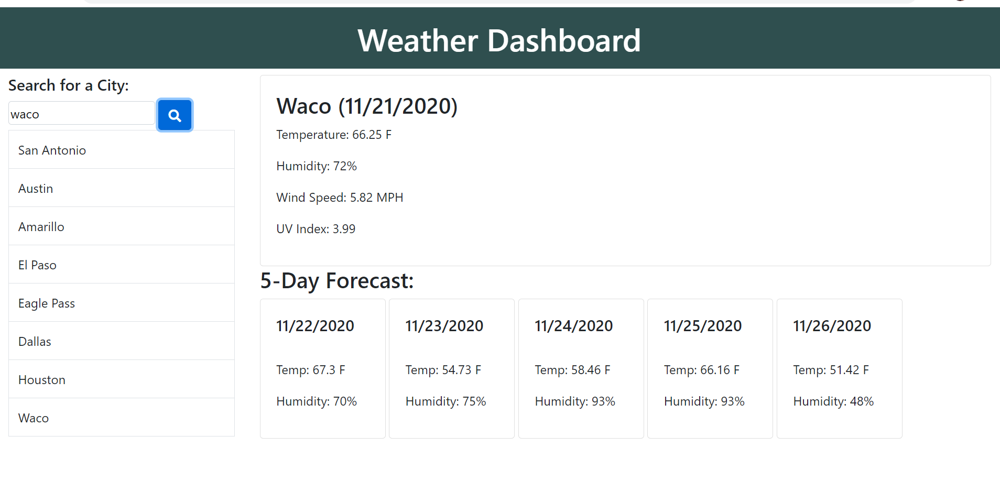
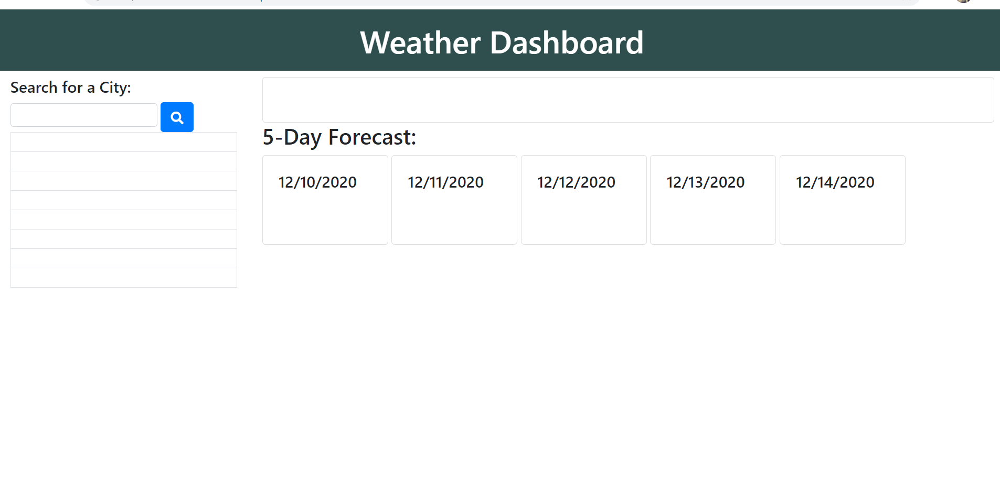
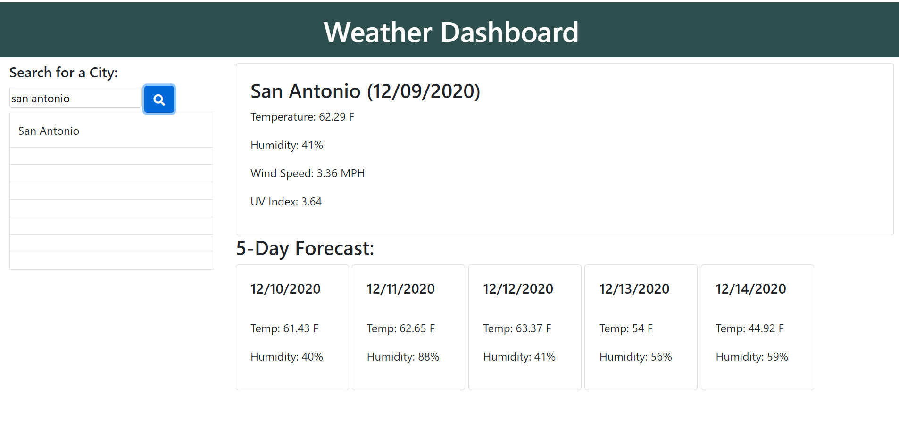

# weather-dashboard

This assignment consisted of creating a weather dashboard. Initially the page is completely blank with only the layout showing up until a city is searched. Once a city is searched the current weather is populated along with the five day forecast. The name of the city is saved to an array which is then used to add the name of the city to the search history. The search history is populated from the array.

The API used to get the weather data is the Open Weather API. A call is made for an object containing all the data for the city specified by the user. From the object, only certain parameters are gathered and displayed to the user.

The Moment library is used to display the current date and to display the date for the forecast. Bootstrap was used to generate the layout of the page and JQuery is primarily used to add the information to each of the HTML sections from the object obtained through the API.

Below is a screenshoot of the page with a full search history:

Below is a screenshot of the page before a city name is entered in:

Below is a screenshot of the page after the very first search:

## Technologies Used

* HTML
* CSS
* Bootstrap
* Fontawesome
* jQuery
* Ajax
* JavaScript
* openweathermap.org API

## URL

Here is a link to the live website:

https://chavalk.github.io/weather-dashboard/

## Contact Information

Email: chavalk@hotmail.com